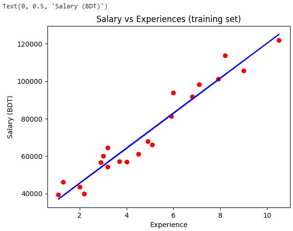
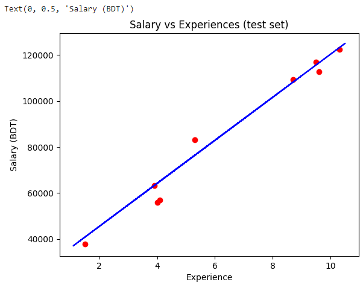
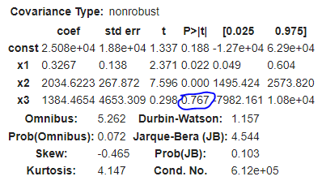
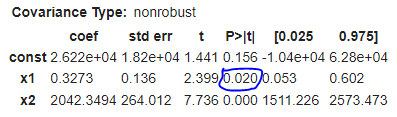
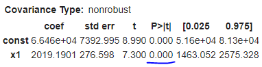
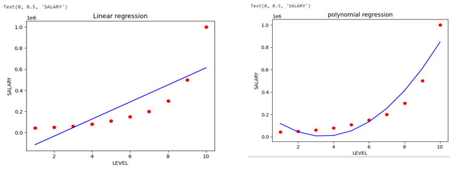
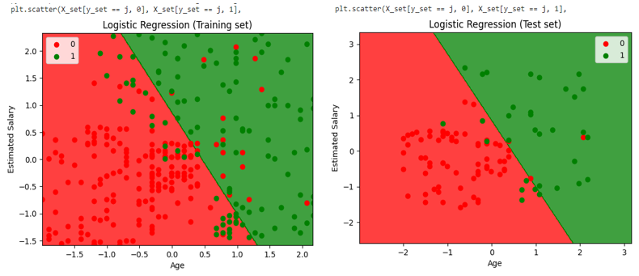
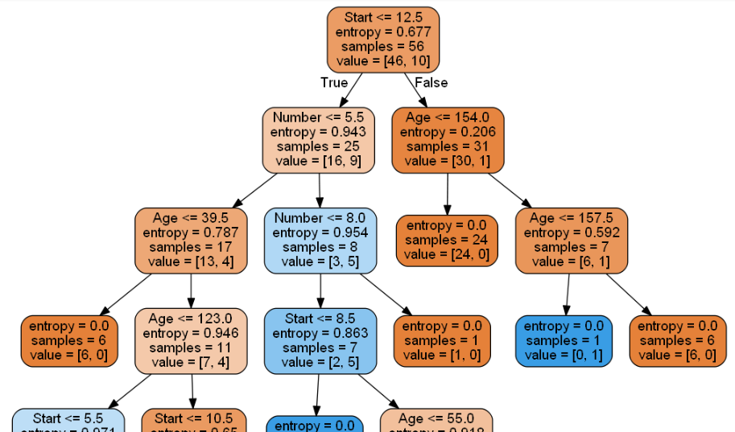
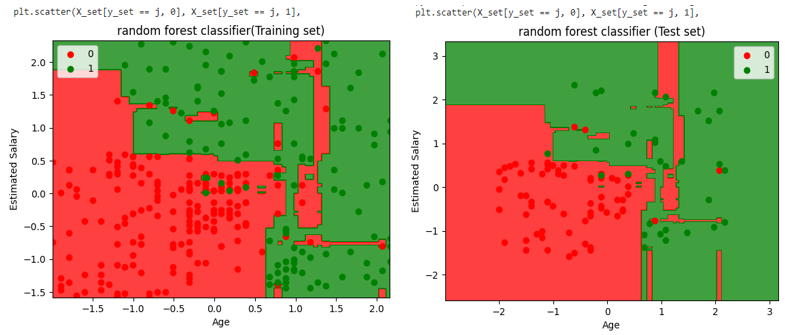
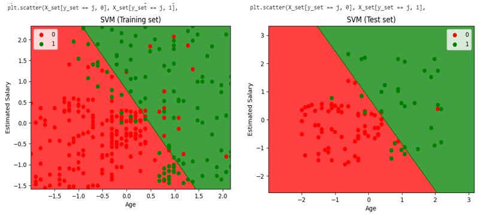

# Simple Linear Regression

Simple linear regression is used to estimate the relationship between two quantitative variables.

### Simple linear regression example
You are a social researcher interested in the relationship between income and happiness. You survey 500 people whose incomes range from 15k to 75k and ask them to rank their happiness on a scale from 1 to 10.
Your independent variable (income) and dependent variable (happiness) are both quantitative, so you can do a regression analysis to see if there is a linear relationship between them.



In the above plot, we can see the real values observations in green dots and predicted values are covered by the red regression line. The regression line shows a correlation between the dependent and independent variable.

The good fit of the line can be observed by calculating the difference between actual values and predicted values. But as we can see in the above plot, most of the observations are close to the regression line, hence our model is good for the training set.



In the above plot, there are observations given by the blue color, and prediction is given by the red regression line. As we can see, most of the observations are close to the regression line, hence we can say our Simple Linear Regression is a good model and able to make good predictions.


# Multiple Linear Regression
Multiple Linear Regression is one of the important regression algorithms which models the linear relationship between a single dependent continuous variable and more than one independent variable.

In this piece, I am going to introduce the Multiple Linear Regression Model. Our problem is about modeling how R&D, administration, and marketing spendings and the state will influence the profit of a company. There are 50 startups data in our dataset.

```bash
x_opt=x[:,[0,1,2,3]]#copy the index 0 to 3 from x in x_opt
regressor_OLS=sm.OLS(endog=y,exog=x_opt.astype(float)).fit()
regressor_OLS.summary()
```



Look at the highest p-values and remove it. In this condition x3(third  dummy variable has the highest one (0.767)

```bash
x_opt=x[:,[0,1,2]]#copy the index 0 to 2 from x in x_opt
regressor_OLS=sm.OLS(endog=y,exog=x_opt.astype(float)).fit()
regressor_OLS.summary()
```



Look at the highest p-values and remove it. In this condition x1(first  dummy variable has the highest one (0.020)

```bash
x_opt=x[:,[0,2]]#copy the index 0 to 3 from x in x_opt
regressor_OLS=sm.OLS(endog=y,exog=x_opt.astype(float)).fit()
regressor_OLS.summary()
```



Look at the highest p-values and remove it. In this condition x3(third  dummy variable has the highest one (0.767)

That’s it. The highest impact variable

#
# Polynomial Regression

Polynomial Regression is a regression algorithm that models the relationship between a dependent(y) and independent variable(x) as nth degree polynomial

## Need for Polynomial Regression:

If we apply a linear model on a linear dataset, then it provides us a good result as we have seen in Simple Linear Regression, but if we apply the same model without any modification on a non-linear dataset, then it will produce a drastic output. Due to which loss function will increase, the error rate will be high, and accuracy will be decreased.
So for such cases, where data points are arranged in a non-linear fashion, we need the Polynomial Regression model. We can understand it in a better way using the below comparison diagram of the linear dataset and non-linear dataset.



#
# Logistic Regression Model

Logistic Regression is used for predicting the categorical dependent variable using a given set of independent variables. Logistic Regression is much similar to the Linear Regression except that how they are used. Linear Regression is used for solving Regression problems, whereas Logistic regression is used for solving the classification problems. In Logistic regression, instead of fitting a regression line, we fit an "S" shaped logistic function, which predicts two maximum values (0 or 1).

Type of Logistic Regression:


Binomial: In binomial Logistic regression, there can be only two possible types of the dependent variables, such as 0 or 1, Pass or Fail, etc.

Multinomial: In multinomial Logistic regression, there can be 3 or more possible unordered types of the dependent variable, such as "cat", "dogs", or "sheep"

Ordinal: In ordinal Logistic regression, there can be 3 or more possible ordered types of dependent variables, such as "low", "Medium", or "High".



The red point observations are for which purchased (dependent variable) is probably 0, i.e., users who did not purchase the car.

On the other hand The green point observations are for which purchased (dependent variable) is probably 1 means user who purchased the car.

But there are some purple points in the green region (Buying the car) and some green points in the red region(Not buying the car). So we can say that younger users with a high estimated salary purchased the car, whereas an older user with a low estimated salary did not purchase the car.

#
# Decision Tree Classification Algorithm

Decision Tree is a Supervised learning technique that can be used for both classification and Regression problems, but mostly it is preferred for solving Classification problems. It is a tree-structured classifier, where internal nodes represent the features of a dataset, branches represent the decision rules and each leaf node represents the outcome.

It is called a decision tree because, similar to a tree, it starts with the root node, which expands on further branches and constructs a tree-like structure.

### Attribute Selection Measures
If the dataset consists of N attributes then deciding which attribute to place at the root or at different levels of the tree as internal nodes is a complicated step. By just randomly selecting any node to be the root can’t solve the issue. If we follow a random approach, it may give us bad results with low accuracy.
For solving this attribute selection problem, researchers worked and devised some solutions. They suggested using some criteria like :

Entropy,

Information gain,

Gini index,

Gain Ratio,

Reduction in Variance

Chi-Square

### Entropy
Entropy is an information theory metric that measures the impurity or uncertainty in a group of observations. It determines how a decision tree chooses to split data.

### Information Gain
We can define information gain as a measure of how much information a feature provides about a class. Information gain helps to determine the order of attributes in the nodes of a decision tree.

The main node is referred to as the parent node, whereas sub-nodes are known as child nodes. We can use information gain to determine how good the splitting of nodes in a decision tree.

### Using Information Gain to Build Decision Trees



#

# Random Forest Algorithm

Random Forest is a popular machine learning algorithm that belongs to the supervised learning technique. It can be used for both Classification and Regression problems in ML. It is based on the concept of ensemble learning, which is a process of combining multiple classifiers to solve a complex problem and to improve the performance of the model.

#### Assumptions for Random Forest

There should be some actual values in the feature variable of the dataset so that the classifier can predict accurate results rather than a guessed result.

The predictions from each tree must have very low correlations.

The Working process can be explained in the below steps and diagram:

Step-1: Select random K data points from the training set.

Step-2: Build the decision trees associated with the selected data points (Subsets).

Step-3: Choose the number N for decision trees that you want to build.

Step-4: Repeat Step 1 & 2.

Step-5: For new data points, find the predictions of each decision tree, and assign the new data points to the category that wins the majority votes

Example: Suppose there is a dataset that contains multiple fruit images. So, this dataset is given to the Random forest classifier. The dataset is divided into subsets and given to each decision tree. During the training phase, each decision tree produces a prediction result, and when a new data point occurs, then based on the majority of results, the Random Forest classifier predicts the final decision. 



The red region is classified for the users who did not purchase the car, and the green region is for the users who purchased the car.

So, in the Random Forest classifier, we have taken 10 trees that have predicted Yes or NO for the Purchased variable. The classifier took the majority of the predictions and provided the result.

The above image is the visualization result for the test set. We can check that there is a minimum number of incorrect predictions (8) without the Overfitting issue. We will get different results by changing the number of trees in the classifier.

#


# Support Vector Machine Algorithm
Support Vector Machine or SVM is one of the most popular Supervised Learning algorithms, which is used for Classification as well as Regression problems. However, primarily, it is used for Classification problems in Machine Learning.

The goal of the SVM algorithm is to create the best line or decision boundary that can segregate n-dimensional space into classes so that we can easily put the new data point in the correct category in the future. This best decision boundary is called a hyperplane.

SVM chooses the extreme points/vectors that help in creating the hyperplane. These extreme cases are called as support vectors, and hence algorithm is termed as Support Vector Machine. Consider the below diagram in which there are two different categories that are classified using a decision boundary or hyperplan

Example: SVM can be understood with the example that we have used in the KNN classifier. Suppose we see a strange cat that also has some features of dogs, so if we want a model that can accurately identify whether it is a cat or dog, so such a model can be created by using the SVM algorithm. We will first train our model with lots of images of cats and dogs so that it can learn about different features of cats and dogs, and then we test it with this strange creature. So as support vector creates a decision boundary between these two data (cat and dog) and choose extreme cases (support vectors), it will see the extreme case of cat and dog. On the basis of the support vectors, it will classify it as a cat.

#### Major Kernel Functions in Support Vector Machine (SVM

Gaussian Kernel

Gaussian Kernel Radial Basis Function (RBF)

Sigmoid Kernel

Polynomial Kernel


.PNG)

 In the output of training set, we got the straight line as hyperplane because we have used a linear kernel in the classifier. And we have also known that for the 2d space, the hyperplane in SVM is a straight line.

 As we can see in the above output image, the SVM classifier has divided the users into two regions (Purchased or Not purchased). Users who purchased the SUV are in the red region with the red scatter points. And users who did not purchase the car are in the green region with green scatter points. The hyperplane has divided the two classes into Purchased and not purchased variable.
